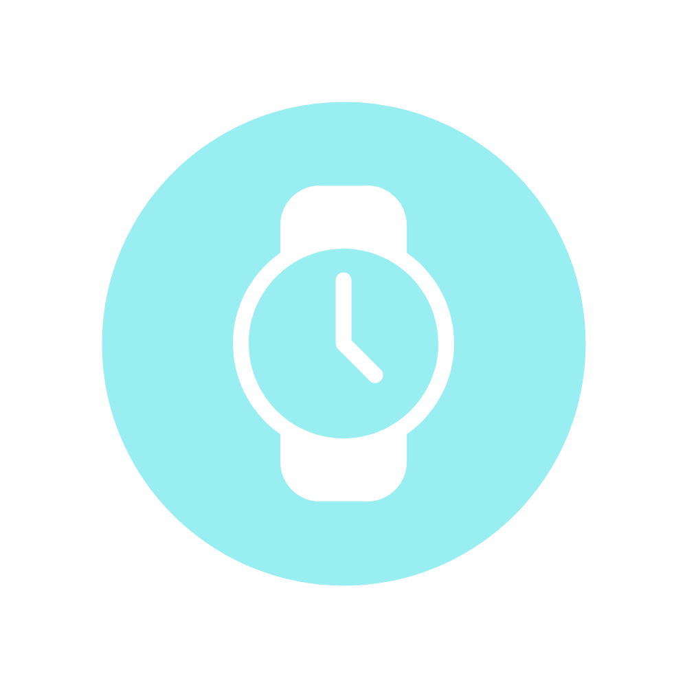
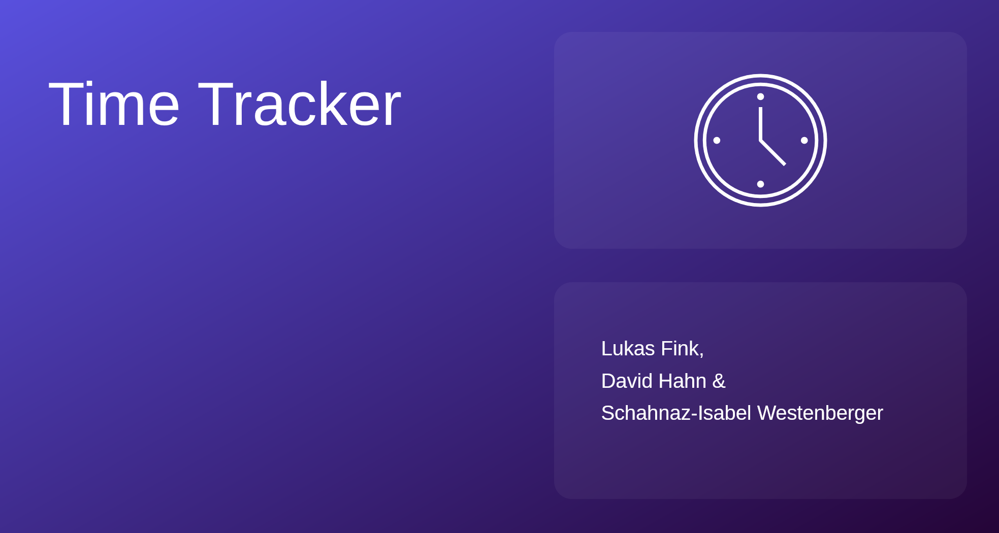

<!-- PROJECT LOGO -->
 

    <!--  -->
  <!-- <h1 align="center">Time Tracker</h1> -->

<!--

  
Table of Contents

  <ol>
    <li>
      <a href="#about-the-project">About The Project</a>
      <ul>
        <li><a href="#built-with">Built With</a></li>
      </ul>
    </li>
    <li>
      <a href="#getting-started">Getting Started</a>
      <ul>
        <li><a href="#prerequisites">Prerequisites</a></li>
        <li><a href="#installation">Installation</a></li>
      </ul>
    </li>
    <li><a href="#usage">Usage</a></li>
    <li><a href="#roadmap">Roadmap</a></li>
    <li><a href="#contributing">Contributing</a></li>
    <li><a href="#license">License</a></li>
    <li><a href="#contact">Contact</a></li>
    <li><a href="#acknowledgments">Acknowledgments</a></li>
  </ol>

-->

<!-- ABOUT THE PROJECT -->
## About The Project

(<a href="#top">back to top</a>)

<!-- Goal -->
## Goal

Die Firma X möchte ein Programm zum Tracken der Arbeitszeit ihrer Mitarbeiter. Diese sollen dort in der Lage sein, Tasks hinzufügen und Zeiten darauf zu buchen. Die Zeiten sollen sich mit einem Online Service synchronisieren, damit diese online gespeichert und abgerufen werden können.

<!-- Requirements -->
## Requirements

* Der Code sollte mit JavaDoc Kommentaren versehen sein.
* Eine readme.md sollte einen groben Überblick über das Projekt geben.
* Mehrere Klassen mit Vererbung, Overriding von Methoden und ggf mehren
* Konstruktoren in der Klasse
* Die Zugriffsrechte für Klassen, Methoden und Properties (Variablen) sollten sinnvoll gewählt
werden
* Durchdachtes Exception Handling. Hierbei kann auf die Vorhandenen Exceptions
* zugegriffen werden, sofern diese für gerechtfertigt erscheinen.
* File IO in irgendeiner Art und Weise. (Logs, CSV Dateien, Properties, XML)
* Multithreading (Zeitintensive Berechnungen NICHT im Gui-Thread)
* Durchdachte und aufgeräumte GUI. (FXML oder Inline)
* Networking (Kommunikation von Server / Client Software über TCP / UDP)

<!-- ROADMAP -->
## Roadmap

- [x] Keep README up to date
- [ ] Zeit buchen
- [ ] Tasks einfügen
    - [ ] Notizen
- [ ] Online Sync
- [ ] Auswertung der Zeiten im Tool
- [ ] Export der Daten als .csv
- [ ] Vorgesetzte sehen aktuelle Zeitwerte

(<a href="#top">back to top</a>)

<!-- LICENSE -->
## License

Distributed under the ___ License. See `LICENSE.txt` for more information.

(<a href="#top">back to top</a>)

<!-- CONTACT -->
## Contact

* Lukas Fink - [Gitlab profile](https://es.technikum-wien.at/ic21b126)

* David Hahn - [Gitlab profile](https://es.technikum-wien.at/ic21b042)

* Isabel Westenberger - [Gitlab profile](https://es.technikum-wien.at/ic20b001)

(<a href="#top">back to top</a>)

<!-- Resources -->
## Resources

Helpful resources:

* [Choose an Open Source License](https://choosealicense.com)
* [GitHub Emoji Cheat Sheet](https://www.webpagefx.com/tools/emoji-cheat-sheet)
* [Font Awesome](https://fontawesome.com)

## How to run the Client and Server
For the Server (has to be started first): `./gradlew server:run` (or you can also click on the Play/Debug icon next to the `main`-Method in `TimeTrackerServer`)

For the Client:`./gradlew client:run`

(<a href="#top">back to top</a>)

