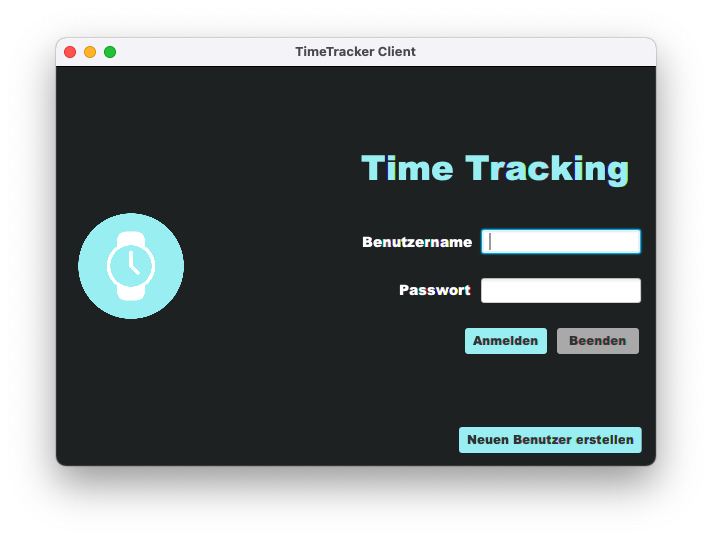
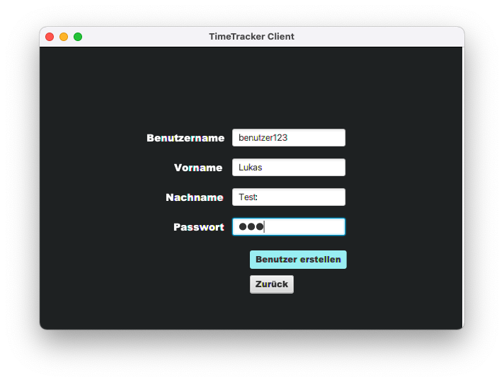
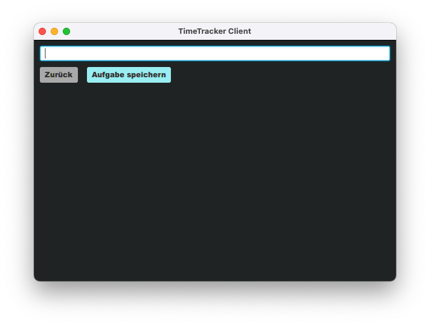
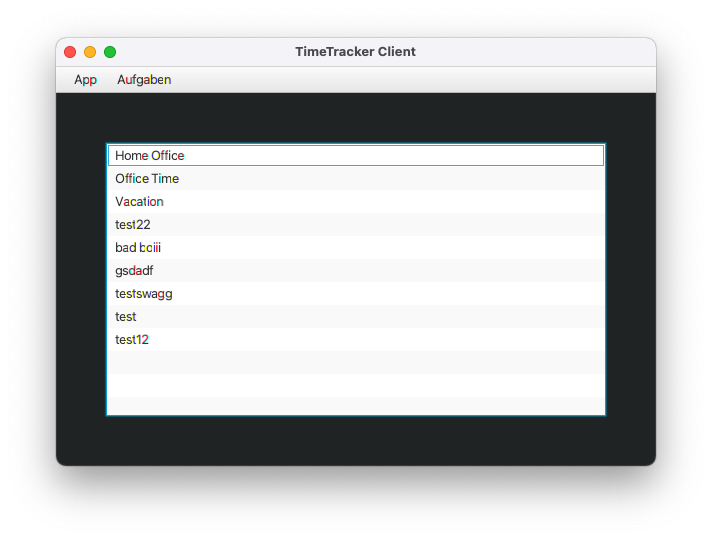
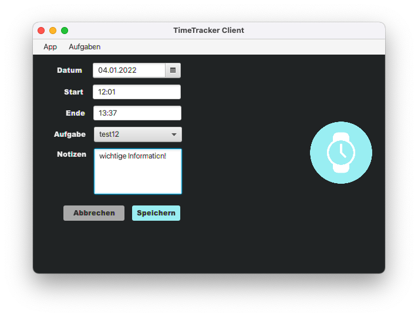
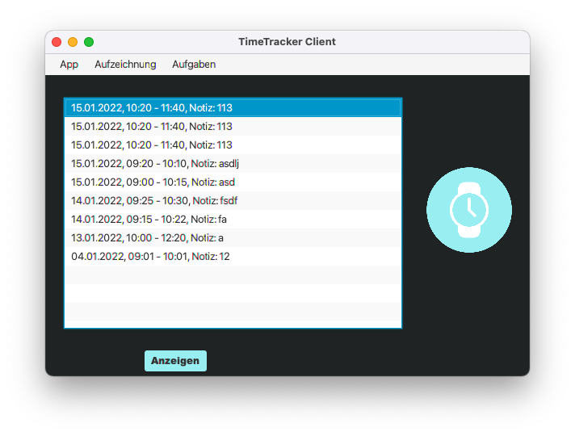
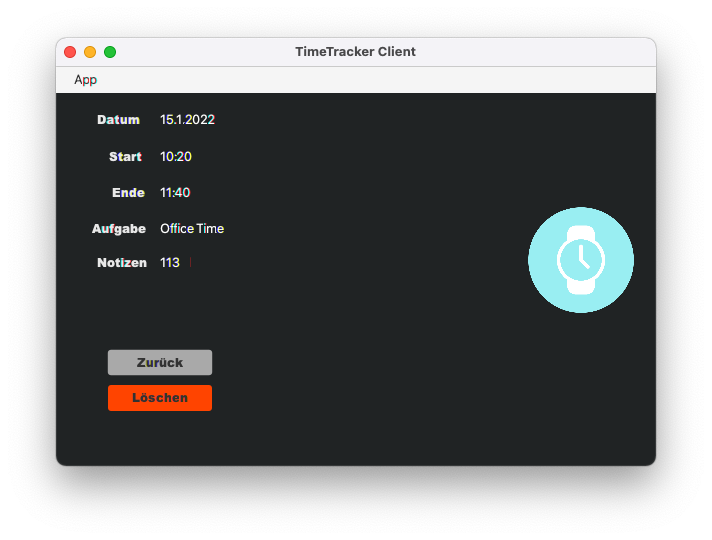

# Timetracker - Zeiterfassung
## Ziel

Die Firma X möchte ein Programm zum Tracken der Arbeitszeit ihrer Mitarbeiter. Diese sollen dort in der Lage sein, Tasks
hinzufügen und Zeiten darauf zu buchen. Die Zeiten sollen sich mit einem Online Service synchronisieren, damit diese
online gespeichert und abgerufen werden können.

## Server und Client starten
Start des Servers: `./gradlew bootRun`
### Wichtiger Hinweis beim ersten Start
Die Datenbank muss beim ersten Start initialisiert werden (mit Schema/Daten, welche in den Files `schema.sql` und `data.sql` liegen).  Dafür muss man im `application.properties` File `spring.sql.init.mode` auf `always` setzen. Wird der Server später erneut gestartet <b>MUSS</b> diese Einstellung auf `never` zurückgesetzt werden.
Der Server failed sonst beim Startup mit einer Error-Message, dass die Tabellen schon existieren  
Wenn der Server läuft (in der Konsole steht ca so etwas: Started TimeTrackerServer in 8.53 seconds (JVM running for 8.989)) kann der Client gestartet werden:`./gradlew run`  

## Übersicht über die Funktionalität

### Erstellen eines Benutzers
Nach dem Start der App kann man sich entweder im Client anmelden oder einen neuen Benutzer erstellen (zu Testzwecken gibt es einen Benutzer `michi`/`michi123`, welcher bereits einige Aufzeichnungen hat). 

### Erstellen einer Aufgabe
Um eine Zeit auf eine Aufgabe zu Buchen, muss zuerst eine Aufgabe erstellt werden, das geht über das Menü, welches nach dem Login sichtbar ist. 

### Übersicht über Aufgaben + Löschmöglichkeit
Danach gelangt man in die Übersicht über alle Aufgaben, wo auch per Rechtsklick Aufgaben gelöscht werden können (sofern keine Zeit auf diese gebucht wurde). 

### Buchen von Zeit auf eine Aufgabe
Wenn eine Aufgabe erstellt wurde kann Zeit darauf aufgezeichnet werden, im Menü unter Aufzeichnungen -> Aufzeichnung erstellen 

### Übersicht über Zeitaufzeichnungen
Nach dem Erstellen einer Zeitaufzeichnung kommt man in die Übersicht (welche auch nach dem Login sichtbar ist, oder über das Menü mit Aufzeichnungen -> Übersicht erreicht werden kann), wo man eine Aufzeichnung auswählen kann. Hier kann auch eine Zeitaufzeichnung ausgewählt werden, und mit einem Klick auf Anzeigen werden alle Details sichtbar. 

### Detailansicht für eine Aufzeichnung + Löschmöglichkeit
In der Detailansicht der Aufzeichnung kann die Aufzeichnung gelöscht werden. 

## Projekt Mitglieder

* Lukas Fink - [Gitlab profile](https://es.technikum-wien.at/ic21b126)

* David Hahn - [Gitlab profile](https://es.technikum-wien.at/ic21b042)

* Isabel Westenberger - [Gitlab profile](https://es.technikum-wien.at/ic20b001)

## Realisierung des Projektes
Das Projekt besteht aus einem Java Client mit JavaFX und einem [Spring Boot Server](https://spring.io/projects/spring-boot), welche eine [h2 - Datenbank](https://www.h2database.com/html/main.html) anbindet. Weiters gibt es im Projekt noch ein Modul "commons", welches Code beinhaltet, das von Client und Server verwendet wird
um Code-Duplication zu vermeiden.  
### Clientseitig wurden folgende Libraries verwendet:
- [Google Gson](https://github.com/google/gson): zur Serialisierung/Deserialisierung von Objekten/JSON bei der Server Kommunikation
- [Retrofit](https://square.github.io/retrofit/) inkl. Type Gson Type-Converter: Typsicherer HTTP-Client für Java (siehe `TimetrackerServerApi` + `NetworkService`)
  
### Serverseitig wurden folgende Libraries verwendet:
- [Spring Boot](https://spring.io/projects/spring-boot): als Framework (Dependency Injection, Datenbank Kommunikation, Web Request handling, Security, etc.)
- [auth0 JWT](https://github.com/auth0/java-jwt): Zur Realisierung von Token-Based Authentication -> nach dem Login bekommt der Client einen Token, welcher für zukünftige Requests als Autorisierung verwendet wird (statt Benutzername und Passwort -> spart u.a. serverseitige Ressourcen in Hinsicht auf de/encryption des Passworts)
- [h2 Datenbank](https://www.h2database.com/html/quickstart.html): File-basierte Datenbank
